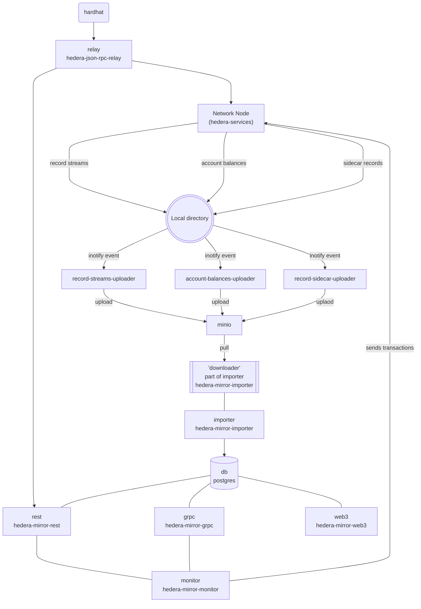

```mermaid
        graph TD 
        A["Network Node \n(hedera-services)"] --"record streams"----> B((("Local directory"))) 
        A--"account balances"----> B
        A --"sidecar records"---->B
        B --"inotify event"--> C["record-streams-uploader"]
        B --"inotify event"--> D["account-balances-uploader"] 
        B --"inotify event"--> E["record-sidecar-uploader"]
        C --upload--> F["minio"]
        D --upload--> F
        E --uplaod--> F
        F--"pull"-->G1[["'downloader'\npart of importer\n hedera-mirror-importer"]]
        G1---G["importer\nhedera-mirror-importer"]
        G-->H[(db\n postgres)]
        H---I["rest\nhedera-mirror-rest"]
        H---J["grpc\nhedera-mirror-grpc"]
        H---K["web3\nhedera-mirror-web3"]
        L["monitor\nhedera-mirror-monitor"]
        J<---L
        I<---L
        L--sends transactions-->A
        R[relay\nhedera-json-rpc-relay]-->I
        R--->A
        T(hardhat)-->R
        
        
```
